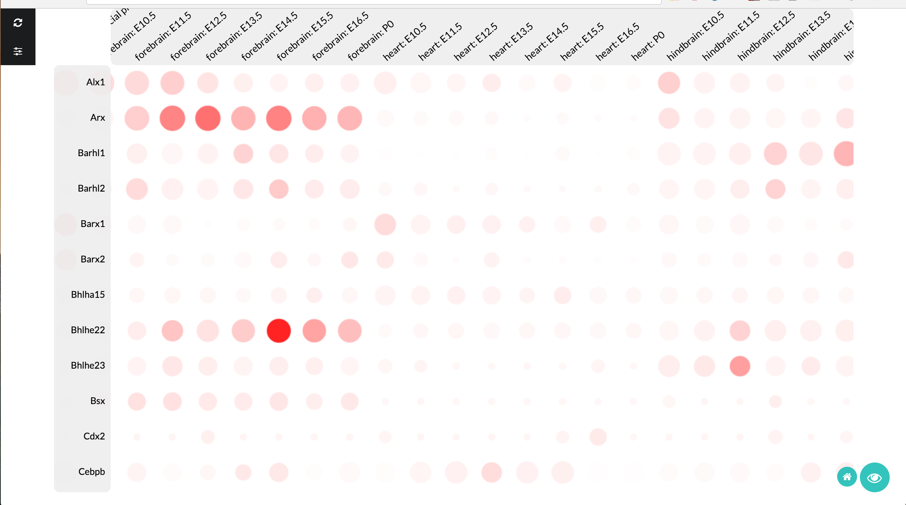
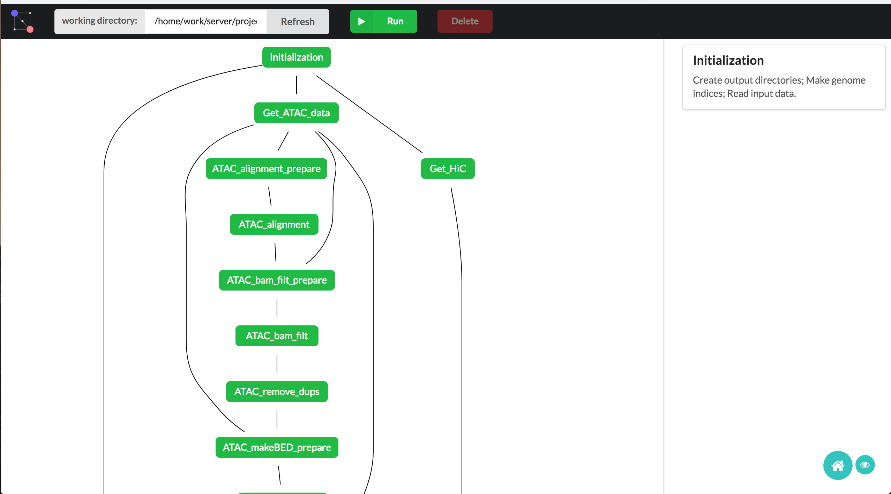

How to use
----------

You must first download the `taiji` and `taiji-viz` binaries.

On desktop
----------

Run `taiji-viz`, open the web browser and go to "127.0.0.1:8787".

On remote server
----------------

1. Run `taiji-viz` on remote server.
2. On local machine, create a SSH tunnel: ssh -L 8787:localhost:8787 username@server
3. Open the web browser and go to "127.0.0.1:8787".

Screenshots:
------------

